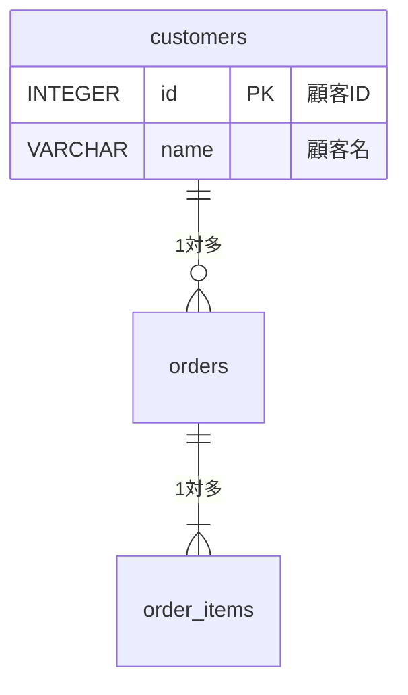

# Markdown to PDF Converter

MarkdownファイルをPuppeteerを使用してPDFに変換するスキル。

## 概要

このスキルは、Markdownファイルを高品質なPDFドキュメントに変換する。以下の機能をサポート：

- **Mermaid図のレンダリング**: ER図、フローチャート、シーケンス図など
- **シンタックスハイライト**: SQL、JavaScript、Python等のコードブロック
- **日本語フォント**: Noto Sans JPによる美しい日本語表示
- **テーブル**: 見やすいスタイルの表
- **改ページ制御**: 見出しや図表の途中で改ページしない

## 使用方法

### 基本的な使い方

```bash
node scripts/md-to-pdf.mjs <markdown-file>
```

入力ファイルと同じディレクトリに同名の`.pdf`ファイルが生成される。

### 出力先を指定

```bash
node scripts/md-to-pdf.mjs <markdown-file> <output-path>
```

### 実行例

```bash
# 同じディレクトリに出力
node scripts/md-to-pdf.mjs docs/database.md
# → docs/database.pdf が生成される

# 出力先を指定
node scripts/md-to-pdf.mjs docs/database.md output/database-design.pdf
```

## 対応するMarkdown要素

| 要素 | サポート状況 |
|------|-------------|
| 見出し (h1-h6) | ✓ |
| テーブル | ✓ |
| コードブロック | ✓（シンタックスハイライト付き）|
| Mermaid図 | ✓ |
| リスト（箇条書き・番号付き）| ✓ |
| 引用 | ✓ |
| 強調（太字・斜体）| ✓ |
| リンク | ✓ |
| 水平線 | ✓ |

## Mermaid図の対応

以下のMermaid図タイプをサポート：

- `erDiagram` - ER図
- `flowchart` / `graph` - フローチャート
- `sequenceDiagram` - シーケンス図
- `classDiagram` - クラス図
- `stateDiagram` - 状態遷移図
- `gantt` - ガントチャート
- `pie` - 円グラフ

### Mermaidの記述例

````markdown

````

## 出力PDF仕様

| 項目 | 設定値 |
|------|--------|
| 用紙サイズ | A4 |
| 余白（上下）| 20mm |
| 余白（左右）| 15mm |
| フォント | Noto Sans JP |
| フォントサイズ | 14px（本文）|

## 依存関係

このスキルは以下のnpmパッケージを使用：

```json
{
  "dependencies": {
    "puppeteer": "^24.x",
    "marked": "^15.x"
  }
}
```

インストールされていない場合：

```bash
npm install puppeteer marked
```

## トラブルシューティング

### Mermaid図が表示されない

1. Mermaidコードブロックの構文を確認
2. インターネット接続を確認（CDNからMermaid.jsを読み込む）
3. タイムアウト（15秒）内にレンダリングが完了しているか確認

### 日本語が文字化けする

- Noto Sans JPフォントがCDNから正しく読み込まれているか確認
- インターネット接続を確認

### PDF生成がエラーになる

- Puppeteerの依存ライブラリがインストールされているか確認
- Linux環境の場合、以下のパッケージが必要な場合がある：
  ```bash
  sudo apt-get install -y libgbm-dev
  ```

## スクリプトの場所

- `scripts/md-to-pdf.mjs` - メインスクリプト
