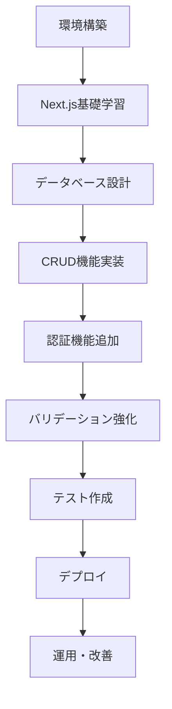

# Next.js + Prisma + PostgreSQL 実践チュートリアル

Next.jsフレームワーク（App Router）とPrisma ORM、PostgreSQL（Docker環境）を使用した、モダンなフルスタックWebアプリケーション開発を学ぶ実践的なチュートリアルです。TypeScriptの型安全性を活用し、サーバーコンポーネント、サーバーアクション、クライアントコンポーネントを適切に組み合わせながら、実用的なユーザー管理システムを段階的に構築していきます。

## チュートリアル概要

### 学習目標
- Node.jsとNext.jsの開発環境構築
- Next.js App Routerの理解と活用
- Server ComponentsとClient Componentsの使い分け
- Server Actionsによるフォーム処理の実装
- Prismaを使用した型安全なデータベースアクセス
- Docker Composeを使用したPostgreSQL環境の構築
- 基本的なCRUD操作を含むユーザー管理機能の実装
- Tailwind CSSによるモダンなUI構築
- フォームバリデーションとエラーハンドリング
- 認証・認可の基礎（NextAuth.js使用）
- テスト戦略とデバッグ手法

### 対象読者
- JavaScriptの基本文法を理解している方（プログラミング初心者歓迎）
- React.jsの基礎知識がある方、または学びながら進めたい方
- モダンなフルスタックWeb開発に興味がある方
- TypeScriptを使った型安全な開発を学びたい方
- Next.jsの最新機能（App Router）を習得したい方

### 特徴
- **最新技術スタック**: Next.js 14、App Router、Server Actions、TypeScript
- **型安全性重視**: TypeScriptとPrismaによる完全な型安全性
- **段階的構築**: 基礎から応用まで段階的に機能を追加
- **実践重視**: 実際に動作するユーザー管理システムを構築
- **モダンUI**: Tailwind CSS + shadcn/uiによる美しいUI
- **ベストプラクティス**: Next.js公式推奨パターンを採用
- **クロスプラットフォーム**: Windows/Mac/Linux対応の開発環境

## 前提条件・環境要件

### 必要なソフトウェア
- **OS**: Windows 10/11、macOS 12以上、Linux（Ubuntu 20.04以上推奨）
- **Node.js**: Node.js 18.17以上（推奨: Node.js 20 LTS）
- **パッケージマネージャー**: npm（Node.js付属）または yarn、pnpm
- **IDE**: Visual Studio Code（推奨）
  - ES7+ React/Redux/React-Native snippets
  - Prettier - Code formatter
  - ESLint
  - Tailwind CSS IntelliSense
  - Prisma
- **コンテナ**: Docker Desktop（最新版）
- **バージョン管理**: Git

### 推奨する基礎知識
- JavaScriptの基本文法（ES6+の機能）
- HTMLとCSSの基本知識
- Reactの基本概念（コンポーネント、Props、State）
- SQLの基本操作（SELECT、INSERT、UPDATE、DELETE）
- ターミナル/コマンドプロンプトの基本操作

## チュートリアル構成

### Step 1: [環境構築とNext.jsプロジェクト作成](https://fcircle-biz.github.io/tech_docs/tutorial/javascript-ecosystem/nextjs/nextjs-tutorial-1.html)
- Node.jsのインストールと環境確認
- Visual Studio Codeのセットアップと必要な拡張機能
- Docker Desktopのインストールと動作確認
- create-next-appによるプロジェクト初期化
- TypeScript、Tailwind CSS、ESLint設定
- プロジェクト構造の理解
- 開発サーバーの起動とHello World

**所要時間**: 1.5時間
**習得内容**: Node.js環境構築、Next.js初期設定、プロジェクト構造理解

### Step 2: [Next.js App Routerの基礎](https://fcircle-biz.github.io/tech_docs/tutorial/javascript-ecosystem/nextjs/nextjs-tutorial-2.html)
- App RouterとPages Routerの違い
- ファイルベースルーティングシステム
- Server ComponentsとClient Components
- レイアウトとテンプレート
- ローディングとエラーハンドリング
- メタデータとSEO対策の基礎
- 動的ルートとパラメータ取得

**所要時間**: 2.5時間
**習得内容**: App Router基礎、ルーティング、Server/Client Components

### Step 3: [データベース設計とPrisma設定](https://fcircle-biz.github.io/tech_docs/tutorial/javascript-ecosystem/nextjs/nextjs-tutorial-3.html)
- Docker ComposeによるPostgreSQL環境構築
- pgAdmin4コンテナの設定と接続確認
- Prismaのインストールと初期化
- Prisma Schemaによるデータベース設計
- Userモデルの定義（id、name、email、password、createdAt、updatedAt）
- マイグレーションの実行
- Prisma Clientの生成と使用方法
- Prisma Studioによるデータ管理

**所要時間**: 2.5時間
**習得内容**: Docker Compose、PostgreSQL設定、Prisma基礎、データベース設計

### Step 4: [ユーザー登録機能の実装](https://fcircle-biz.github.io/tech_docs/tutorial/javascript-ecosystem/nextjs/nextjs-tutorial-4.html)
- ユーザー登録フォームの作成（Client Component）
- Server Actionsによるフォーム送信処理
- zodライブラリを使用したバリデーション
- パスワードのハッシュ化（bcrypt使用）
- Prismaを使用したユーザーデータの保存
- エラーハンドリングとユーザーフィードバック
- useFormStateとuseFormStatusの活用
- リダイレクト処理

**所要時間**: 3時間
**習得内容**: Server Actions、フォーム処理、バリデーション、データ保存

### Step 5: [ユーザー一覧・詳細表示機能](https://fcircle-biz.github.io/tech_docs/tutorial/javascript-ecosystem/nextjs/nextjs-tutorial-5.html)
- ユーザー一覧ページの実装（Server Component）
- Prismaによるデータ取得とクエリ最適化
- テーブルコンポーネントの作成（Tailwind CSS）
- ページネーション機能の実装
- 検索機能（名前・メールアドレス）の追加
- ユーザー詳細ページの作成
- 動的ルート（/users/[id]）の実装
- データローディングとSuspense

**所要時間**: 3.5時間
**習得内容**: データ取得、一覧表示、ページング、検索機能、動的ルート

### Step 6: [ユーザー更新・削除機能](https://fcircle-biz.github.io/tech_docs/tutorial/javascript-ecosystem/nextjs/nextjs-tutorial-6.html)
- ユーザー編集フォームの作成
- Server Actionsによる更新処理の実装
- 楽観的UI更新（useOptimistic使用）
- 削除確認モーダルの実装
- Server Actionsによる削除処理
- トランザクション処理の基礎
- Revalidation（revalidatePath、revalidateTag）
- エラーハンドリングとロールバック

**所要時間**: 3時間
**習得内容**: 更新・削除機能、楽観的UI、トランザクション、Revalidation

### Step 7: [認証とセキュリティの実装](https://fcircle-biz.github.io/tech_docs/tutorial/javascript-ecosystem/nextjs/nextjs-tutorial-7.html)
- NextAuth.js（Auth.js）のセットアップ
- Credentials Providerによるログイン機能
- セッション管理とミドルウェア
- 保護されたルートの実装
- ログイン・ログアウト機能
- セッション情報の取得と使用
- CSRF対策（Server Actionsのトークン）
- 環境変数によるシークレット管理
- セキュリティベストプラクティス

**所要時間**: 3.5時間
**習得内容**: NextAuth.js、認証・認可、セッション管理、セキュリティ対策

### Step 8: [バリデーションとエラーハンドリング](https://fcircle-biz.github.io/tech_docs/tutorial/javascript-ecosystem/nextjs/nextjs-tutorial-8.html)
- zodによる高度なバリデーションスキーマ
- カスタムバリデーションルールの作成
- フィールドレベルとフォームレベルのエラー表示
- リアルタイムバリデーション（Client Side）
- サーバーサイドバリデーションの実装
- グローバルエラーハンドリング（error.tsx）
- Not Foundページのカスタマイズ（not-found.tsx）
- エラーバウンダリとエラーリカバリ
- トーストメッセージによるユーザー通知

**所要時間**: 2.5時間
**習得内容**: 高度なバリデーション、エラーハンドリング、UX改善

### Step 9: [テストとデバッグ](https://fcircle-biz.github.io/tech_docs/tutorial/javascript-ecosystem/nextjs/nextjs-tutorial-9.html)
- Jestのセットアップとテスト環境構築
- React Testing Libraryによるコンポーネントテスト
- Server Actionsのユニットテスト
- モックとスタブの活用
- Playwrightによるエンドツーエンドテスト
- テストデータベースの設定
- Next.js DevToolsの活用
- React DevToolsによるデバッグ
- パフォーマンス計測とボトルネック解析

**所要時間**: 3時間
**習得内容**: Jest、Testing Library、E2Eテスト、デバッグ手法

### Step 10: [デプロイメントと本番環境への準備](https://fcircle-biz.github.io/tech_docs/tutorial/javascript-ecosystem/nextjs/nextjs-tutorial-10.html)
- 本番環境用の設定と環境変数管理
- Vercelへのデプロイ手順
- Supabase PostgreSQLへの接続設定
- ドメイン設定とカスタムドメイン
- 環境変数の本番設定
- ビルド最適化とパフォーマンスチューニング
- エラー監視とロギング（Sentry）
- CI/CDパイプラインの基礎
- セキュリティチェックリスト
- 運用時のベストプラクティス

**所要時間**: 2.5時間
**習得内容**: Vercelデプロイ、本番環境設定、運用準備、監視

## 環境セットアップ手順（概要）

### 1. Node.jsのインストール
```bash
# Node.jsのバージョン確認
node --version  # v20.x.x 以上
npm --version   # 10.x.x 以上

# Windows: 公式サイトからインストーラーをダウンロード
# https://nodejs.org/

# macOS (Homebrew使用)
brew install node@20

# Linux (Ubuntu/Debian)
curl -fsSL https://deb.nodesource.com/setup_20.x | sudo -E bash -
sudo apt-get install -y nodejs
```

### 2. Next.jsプロジェクトの作成
```bash
# create-next-appを使用してプロジェクトを作成
npx create-next-app@latest user-management-app

# インタラクティブプロンプトでの選択:
# ✔ Would you like to use TypeScript? … Yes
# ✔ Would you like to use ESLint? … Yes
# ✔ Would you like to use Tailwind CSS? … Yes
# ✔ Would you like to use `src/` directory? … Yes
# ✔ Would you like to use App Router? … Yes
# ✔ Would you like to customize the default import alias? … No

# プロジェクトディレクトリに移動
cd user-management-app

# 開発サーバーの起動
npm run dev
```

### 3. Prismaのインストールと初期化
```bash
# Prismaのインストール
npm install prisma @prisma/client
npm install -D prisma

# Prismaの初期化（PostgreSQL用）
npx prisma init --datasource-provider postgresql

# .envファイルが生成され、DATABASE_URLを設定
```

### 4. Docker ComposeによるPostgreSQL環境構築
```yaml
# docker-compose.yml
version: '3.8'

services:
  postgres:
    image: postgres:16-alpine
    container_name: nextjs_postgres
    restart: unless-stopped
    environment:
      POSTGRES_USER: postgres
      POSTGRES_PASSWORD: postgres
      POSTGRES_DB: userdb
    ports:
      - "5432:5432"
    volumes:
      - postgres_data:/var/lib/postgresql/data

  pgadmin:
    image: dpage/pgadmin4
    container_name: nextjs_pgadmin
    restart: unless-stopped
    environment:
      PGADMIN_DEFAULT_EMAIL: admin@example.com
      PGADMIN_DEFAULT_PASSWORD: admin
    ports:
      - "5050:80"
    depends_on:
      - postgres

volumes:
  postgres_data:
```

```bash
# Dockerコンテナの起動
docker-compose up -d

# コンテナの状態確認
docker-compose ps
```

### 5. Prisma Schemaの定義
```prisma
// prisma/schema.prisma
generator client {
  provider = "prisma-client-js"
}

datasource db {
  provider = "postgresql"
  url      = env("DATABASE_URL")
}

model User {
  id        String   @id @default(cuid())
  name      String
  email     String   @unique
  password  String
  createdAt DateTime @default(now())
  updatedAt DateTime @updatedAt

  @@map("users")
}
```

```bash
# マイグレーションの実行
npx prisma migrate dev --name init

# Prisma Clientの生成
npx prisma generate

# Prisma Studioでデータ確認
npx prisma studio
```

### 6. 必要なパッケージのインストール
```bash
# フォームとバリデーション
npm install zod react-hook-form @hookform/resolvers

# パスワードハッシュ化
npm install bcryptjs
npm install -D @types/bcryptjs

# 認証
npm install next-auth@beta

# UI コンポーネント（オプション）
npm install @radix-ui/react-dialog @radix-ui/react-dropdown-menu
npm install class-variance-authority clsx tailwind-merge

# 日付フォーマット
npm install date-fns

# アイコン
npm install lucide-react
```

## 学習の進め方

### 推奨される学習方法
1. **順番通りに進める**: 各ステップは前のステップの知識を前提としています
2. **実際にコードを書く**: サンプルコードをコピペするだけでなく、理解しながら入力
3. **公式ドキュメントを参照**: Next.js、Prisma、TypeScriptの公式ドキュメントを読む習慣をつける
4. **実験する**: コードを変更して動作を確認し、理解を深める
5. **エラーに向き合う**: エラーメッセージを読んで原因を理解し、解決方法を考える
6. **コミットする**: Gitで定期的にコミットし、変更履歴を管理する

### 開発の流れ


### トラブルシューティングのヒント
- **ポート競合**: 既に3000番ポートが使用されている場合は`PORT=3001 npm run dev`
- **Docker起動エラー**: Docker Desktopが起動していることを確認
- **Prismaエラー**: `npx prisma generate`を実行してClientを再生成
- **型エラー**: TypeScriptの型定義を確認、必要に応じて`@types`パッケージをインストール
- **キャッシュ問題**: `.next`フォルダを削除して再ビルド
- **環境変数**: `.env.local`ファイルが正しく設定されているか確認

## プロジェクト構造

### 最終的なディレクトリ構成
```
user-management-app/
├── .next/                      # Next.jsビルド出力（自動生成）
├── node_modules/              # 依存パッケージ
├── prisma/
│   ├── schema.prisma          # Prismaスキーマ定義
│   └── migrations/            # マイグレーションファイル
├── public/                    # 静的ファイル
│   ├── favicon.ico
│   └── images/
├── src/
│   ├── app/                   # App Router（ルーティング）
│   │   ├── (auth)/           # 認証関連ルートグループ
│   │   │   ├── login/
│   │   │   │   └── page.tsx
│   │   │   └── register/
│   │   │       └── page.tsx
│   │   ├── users/            # ユーザー管理
│   │   │   ├── [id]/
│   │   │   │   ├── edit/
│   │   │   │   │   └── page.tsx
│   │   │   │   └── page.tsx
│   │   │   ├── new/
│   │   │   │   └── page.tsx
│   │   │   └── page.tsx
│   │   ├── api/              # API Routes
│   │   │   └── auth/
│   │   │       └── [...nextauth]/
│   │   │           └── route.ts
│   │   ├── layout.tsx        # ルートレイアウト
│   │   ├── page.tsx          # ホームページ
│   │   ├── error.tsx         # エラーページ
│   │   ├── not-found.tsx     # 404ページ
│   │   └── loading.tsx       # ローディング
│   ├── components/           # 再利用可能なコンポーネント
│   │   ├── ui/              # UIコンポーネント
│   │   │   ├── button.tsx
│   │   │   ├── input.tsx
│   │   │   ├── card.tsx
│   │   │   └── table.tsx
│   │   ├── forms/           # フォームコンポーネント
│   │   │   ├── user-form.tsx
│   │   │   └── login-form.tsx
│   │   ├── layout/          # レイアウトコンポーネント
│   │   │   ├── header.tsx
│   │   │   ├── footer.tsx
│   │   │   └── sidebar.tsx
│   │   └── providers/       # Providerコンポーネント
│   │       └── session-provider.tsx
│   ├── lib/                  # ユーティリティとヘルパー
│   │   ├── prisma.ts        # Prismaクライアント
│   │   ├── auth.ts          # 認証設定
│   │   ├── validations.ts   # Zodスキーマ
│   │   └── utils.ts         # 汎用ユーティリティ
│   ├── actions/             # Server Actions
│   │   ├── user-actions.ts
│   │   └── auth-actions.ts
│   ├── types/               # TypeScript型定義
│   │   └── index.ts
│   └── middleware.ts        # Next.jsミドルウェア
├── .env.local               # 環境変数（ローカル）
├── .env.example             # 環境変数のサンプル
├── .eslintrc.json          # ESLint設定
├── .gitignore              # Git除外設定
├── docker-compose.yml      # Docker Compose設定
├── next.config.js          # Next.js設定
├── package.json            # npmパッケージ設定
├── postcss.config.js       # PostCSS設定
├── tailwind.config.ts      # Tailwind CSS設定
└── tsconfig.json           # TypeScript設定
```

## 技術スタック詳細

### フロントエンド
- **Next.js 14**: React フレームワーク、App Router使用
- **React 18**: UIライブラリ、Server Components対応
- **TypeScript**: 型安全性を提供
- **Tailwind CSS**: ユーティリティファーストCSSフレームワーク

### バックエンド
- **Next.js Server Actions**: サーバーサイド処理
- **Prisma**: TypeScript対応のORM
- **PostgreSQL**: リレーショナルデータベース
- **NextAuth.js**: 認証ライブラリ

### バリデーション・セキュリティ
- **Zod**: スキーマバリデーション
- **bcryptjs**: パスワードハッシュ化
- **CSRF Protection**: Next.js組み込み

### 開発ツール
- **Docker & Docker Compose**: コンテナ環境
- **ESLint**: コード品質チェック
- **Prettier**: コードフォーマッター
- **Jest & Testing Library**: ユニットテスト
- **Playwright**: E2Eテスト

## 参考リソース

### 公式ドキュメント
- [Next.js 公式ドキュメント](https://nextjs.org/docs)
- [React 公式ドキュメント](https://react.dev/)
- [Prisma ドキュメント](https://www.prisma.io/docs)
- [TypeScript ドキュメント](https://www.typescriptlang.org/docs/)
- [Tailwind CSS ドキュメント](https://tailwindcss.com/docs)
- [NextAuth.js ドキュメント](https://next-auth.js.org/)

### 学習リソース
- [Next.js Learn Course](https://nextjs.org/learn) - 公式チュートリアル
- [React Foundations](https://nextjs.org/learn/react-foundations) - React基礎
- [TypeScript for Beginners](https://www.typescriptlang.org/docs/handbook/typescript-from-scratch.html)
- [Prisma Getting Started](https://www.prisma.io/docs/getting-started)

### コミュニティ
- [Next.js Discord](https://nextjs.org/discord)
- [Prisma Discord](https://pris.ly/discord)
- [日本語コミュニティ](https://nextjs-ja-translation-docs.vercel.app/)

### 推奨書籍
- 「Next.js 入門: Server Actions・App Routerによるモダン開発」
- 「実践TypeScript - BFFとNext.js & Nuxt.jsの型定義」
- 「モダンJavaScript入門 第2版」

## 重要な注意事項

### セキュリティ
- **SECRET_KEY**: 本番環境では必ず強力なシークレットキーを設定
- **環境変数**: `.env.local`をGitにコミットしない（`.gitignore`に含める）
- **パスワード**: bcryptで必ずハッシュ化してから保存
- **HTTPS**: 本番環境では必ずHTTPS通信を使用
- **入力検証**: クライアント・サーバー両方でバリデーション実施

### パフォーマンス
- **Server Components**: データ取得にはServer Componentsを優先使用
- **Dynamic Import**: 大きなコンポーネントは動的インポート
- **Image Optimization**: `next/image`を使用して画像最適化
- **Font Optimization**: `next/font`でフォント最適化
- **Caching**: 適切なキャッシュ戦略を実装

### データベース
- **コネクションプール**: Prismaのコネクション数を適切に設定
- **インデックス**: 頻繁に検索するカラムにインデックス作成
- **マイグレーション**: 本番環境へのマイグレーションは慎重に実施
- **バックアップ**: 定期的なデータベースバックアップ

## まとめ

このチュートリアルを完了することで、以下のスキルが身につきます:

### 技術スキル
1. **Next.js App Router**: モダンなNext.js開発手法の習得
2. **TypeScript**: 型安全なコード記述能力
3. **Prisma ORM**: データベース操作の効率化
4. **認証・認可**: NextAuth.jsを使用したセキュアな実装
5. **フルスタック開発**: フロントエンドからバックエンドまでの一貫した開発

### 実践スキル
1. **CRUD操作**: 基本的なWebアプリケーション機能の実装
2. **フォーム処理**: Server Actionsによるモダンなフォーム処理
3. **エラーハンドリング**: 適切なエラー処理とユーザーフィードバック
4. **テスト**: 品質を保証するテスト手法
5. **デプロイ**: Vercelへの本番デプロイとCI/CD

### ベストプラクティス
1. **コード品質**: ESLintとPrettierによる一貫性のあるコード
2. **型安全性**: TypeScriptとPrismaによる完全な型チェック
3. **セキュリティ**: 基本的なWebアプリケーションセキュリティ対策
4. **パフォーマンス**: Next.jsの最適化機能を活用した高速化
5. **保守性**: 構造化されたコードと適切なコメント

Next.jsは「Production-ready React framework」として、本番環境で使える強力な機能が標準で提供されています。このチュートリアルを通じて、モダンなフルスタックWeb開発のベストプラクティスを習得し、実践的なアプリケーション開発スキルを身につけてください。

Happy Next.js Coding! 🚀
