いいですね。すぐ使い回せる**Mermaidひな形集**を置いておきます。`%%`のコメントを目印に、IDやラベルだけ差し替えてください。

---

# 1) 業務フロー（基本・分岐/ループ付き）

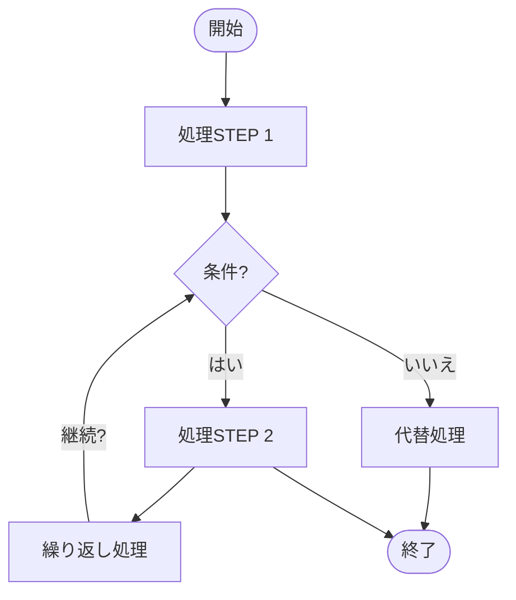

---

# 2) スイムレーン（部門/担当レーン）

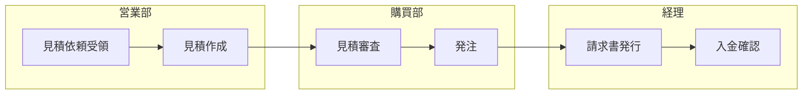

---

# 3) BPMNっぽい表現（ゲートウェイ代替）

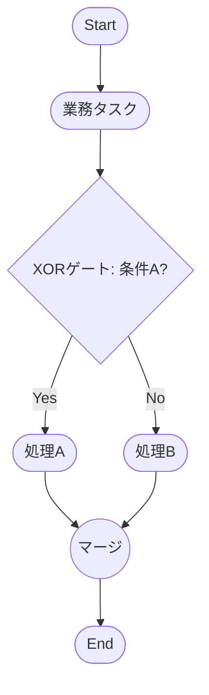

---

# 4) シーケンス図（時系列インタラクション）

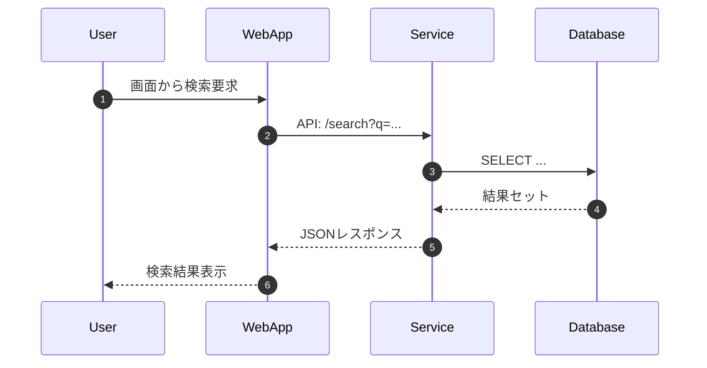

---

# 5) ER 図（論理ER／カーディナリティ）

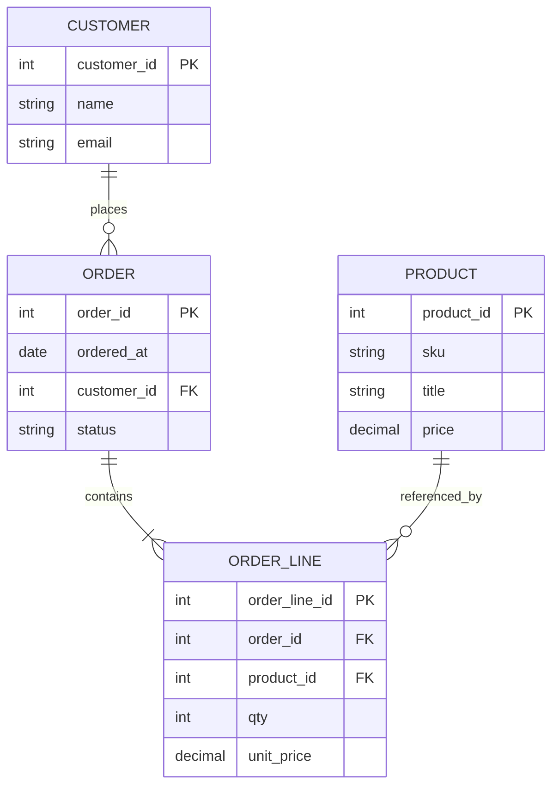

---

# 6) クラス図（オブジェクト指向設計）

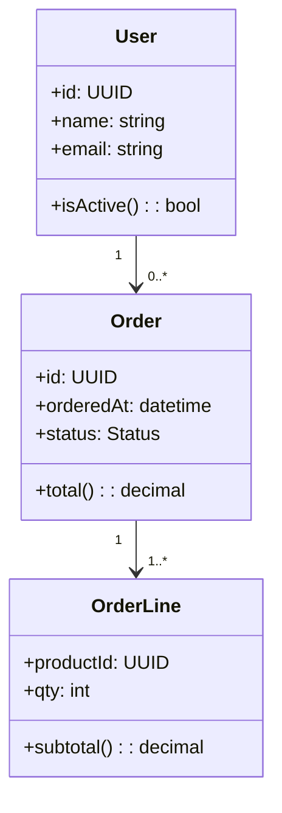

---

# 7) 状態遷移図（State Machine）

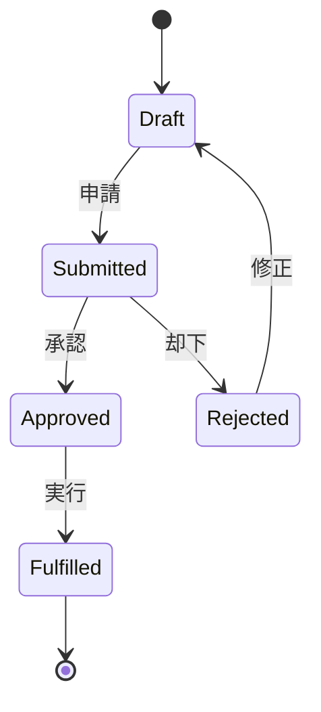

---

# 8) データフロー（DFD風）

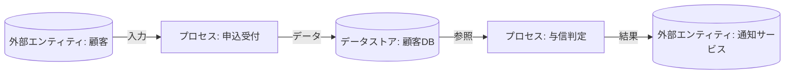

---

# 9) システム構成（レイヤ/サブシステム）

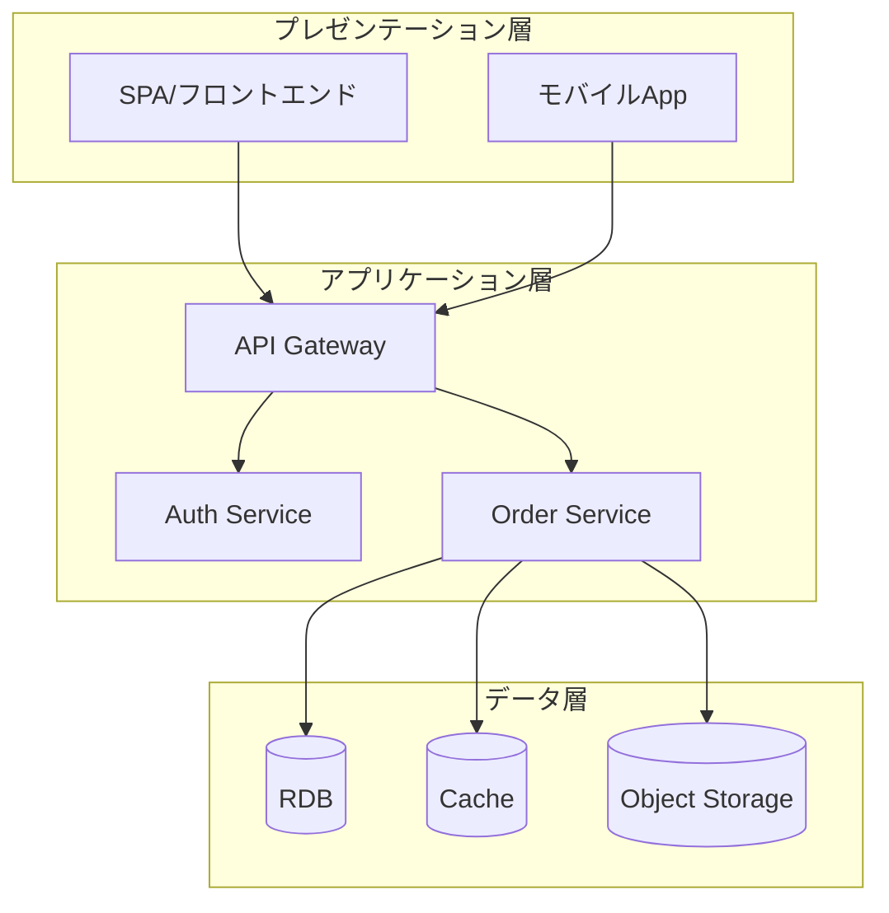

---

# 10) 業務⇄機能マッピング（バイパートイト）

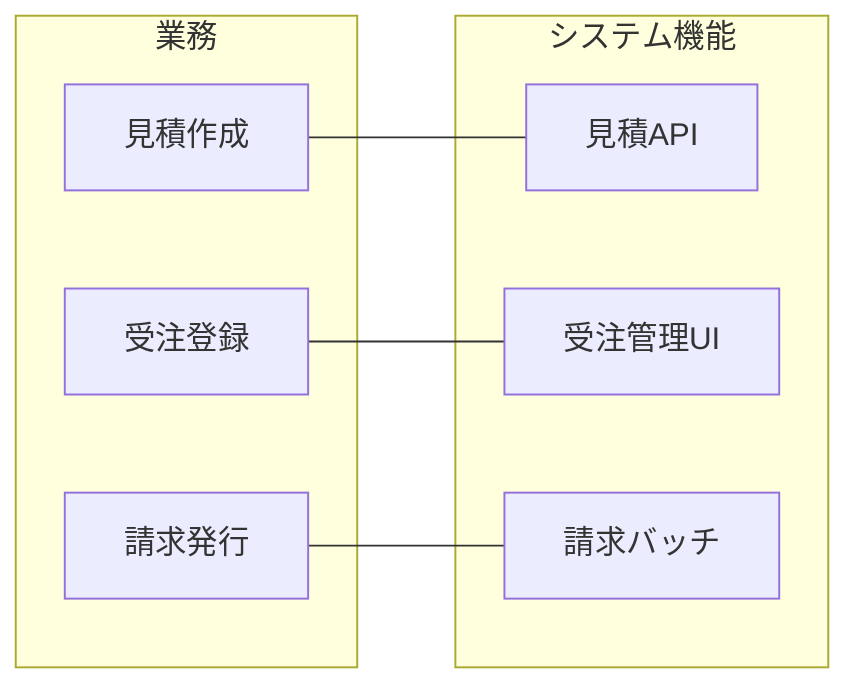

---

# 11) タイムライン（時系列イベント）

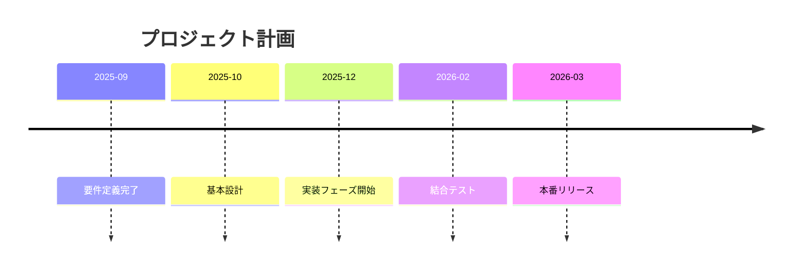

---

# 12) カスタマージャーニー（Journey）

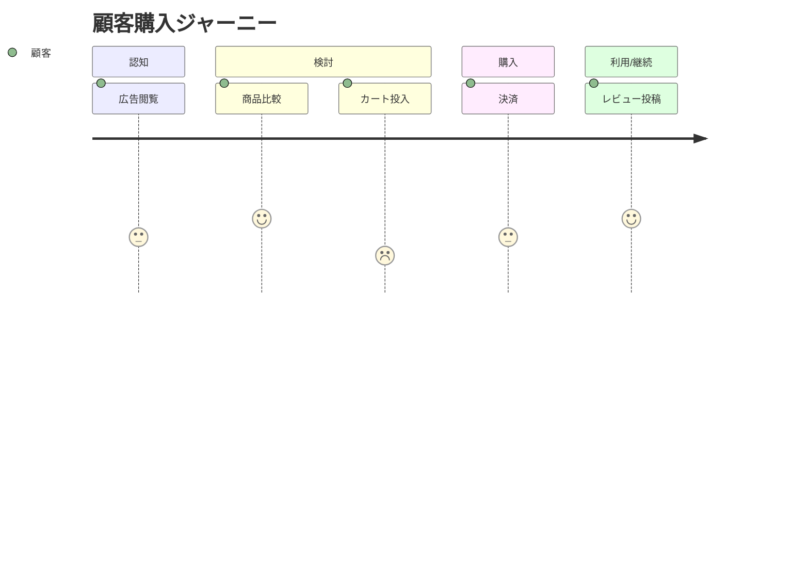

---

# 使い方のコツ（超要約）

* 図の**向き**は `flowchart TD/LR` を切り替え。
* **レーン**は `subgraph` で代用。
* **DB/外部**は `[(DB)]` / `((外部))` など形状記法で視認性UP。
* コードを**部品化**したいなら、ひな形をスニペット管理（VS Codeなど）に登録。

必要なら、この中から「うちの標準」に合わせた**命名規約・色分け・凡例**付きの拡張テンプレを作ります。どの図から標準化します？
