すぐ使い回せる **Mermaidひな形集**です。`%%` のコメントを目印に、IDやラベルだけ差し替えてください。

---

## v3 デザイン向け配色ノート

v3（Graphite × Iris）では、Mermaidノードへ `style` 命令で色を付ける場合は
クール差し色（primary/cyan/amber/emerald）のパレットに合わせること。

| 用途 | 推奨塗り色 | 推奨枠色 | 文字色 |
|------|-----------|---------|-------|
| 処理ノード（primary） | `#12151e` | `#6366f1` | `#a3acfb` |
| シアン差し色 | `#0f1a1e` | `#06b6d4` | `#67e8f9` |
| アンバー差し色 | `#1a1408` | `#f59e0b` | `#fcd34d` |
| エメラルド差し色 | `#0a1912` | `#10b981` | `#6ee7b7` |
| 中立ノード | `#171c27` | `#3d4453` | `#c2cad8` |

**ライトモード向け**: 塗りは `#f0f1ff`（アイリス）/ `#ecfeff`（シアン）/ `#fffbeb`（アンバー）/ `#ecfdf5`（エメラルド）。枠と文字は上表の枠色・暗い文字色に合わせる。

---

## Mermaid 記法ルール（v3 必須）

CLAUDE.md で定めたルールをここにも再掲する。すべての Mermaid 図で遵守すること。

### 1. HTMLエンティティ禁止
`&#40;` `&#41;` `&#38;` などの HTML エンティティは Mermaid で正しく解釈されない。絶対に使わない。

### 2. 括弧の扱い
- 半角括弧 `()` は Mermaid で特殊文字として認識されるため、**全角括弧 `（）`** を使う。
- またはノードテキスト全体をダブルクォートで囲む: `A["Text (with parentheses)"]`

### 3. アンパサンド
`&` の代わりに全角の `＆` を使う。

### 4. ノード内改行
`<br/>` を使う場合はダブルクォートで囲む: `A["Line1<br/>Line2"]`

**正しい例:**
```
flowchart TD
    A["第1章: 概要（現在）"] --> B{OS}
    B -->|Windows| C["Windows環境構築"]
```

**間違った例（構文エラーになる）:**
```
flowchart TD
    A[第1章: 概要<br/>&#40;現在&#41;] --> B{OS}
    B -->|Windows| C[Windows環境<br/>Setup]
```

---

# 1) 業務フロー（基本・分岐/ループ付き）

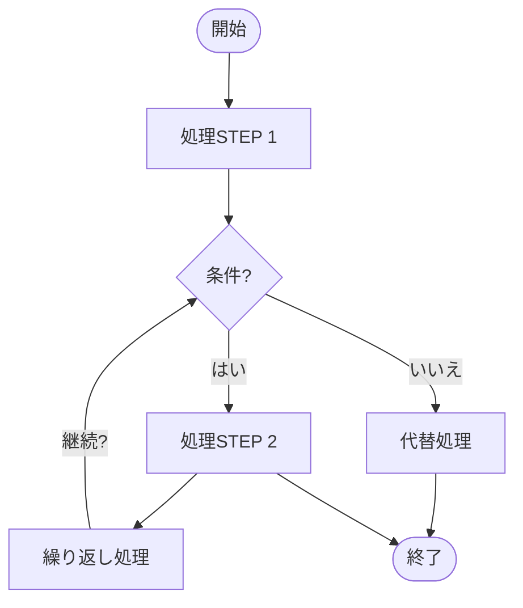

---

# 2) スイムレーン（部門/担当レーン）

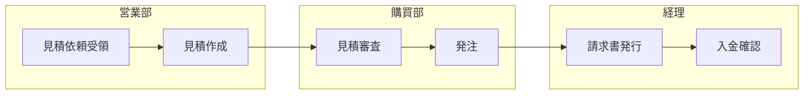

---

# 3) BPMNっぽい表現（ゲートウェイ代替）

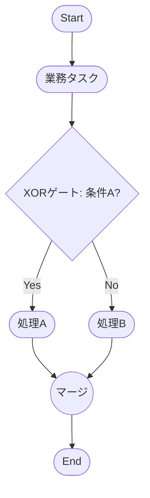

---

# 4) シーケンス図（時系列インタラクション）

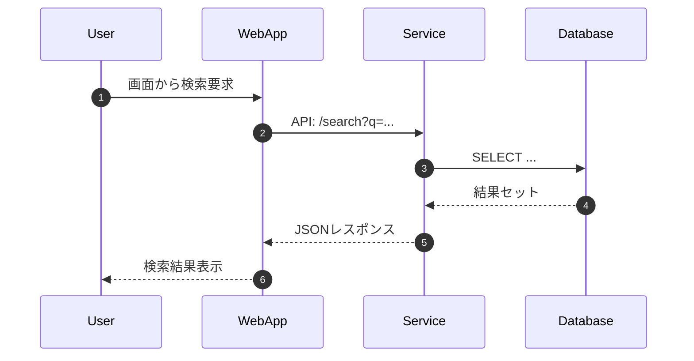

---

# 5) ER 図（論理ER／カーディナリティ）

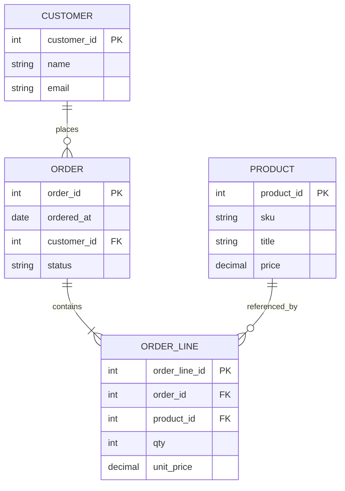

---

# 6) クラス図（オブジェクト指向設計）

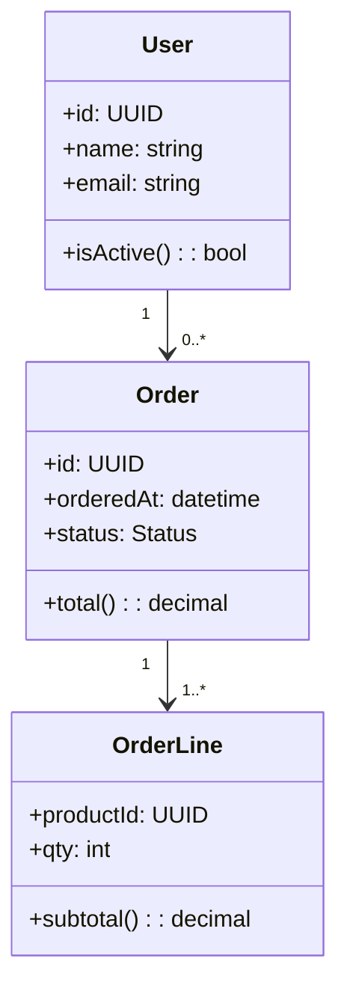

---

# 7) 状態遷移図（State Machine）

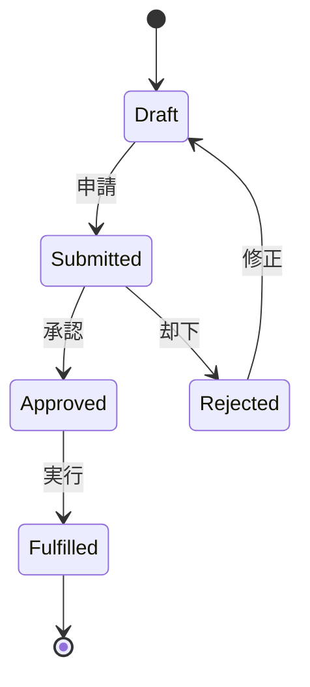

---

# 8) データフロー（DFD風）

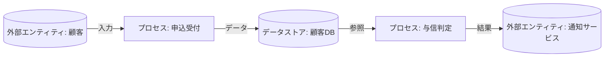

---

# 9) システム構成（レイヤ/サブシステム）

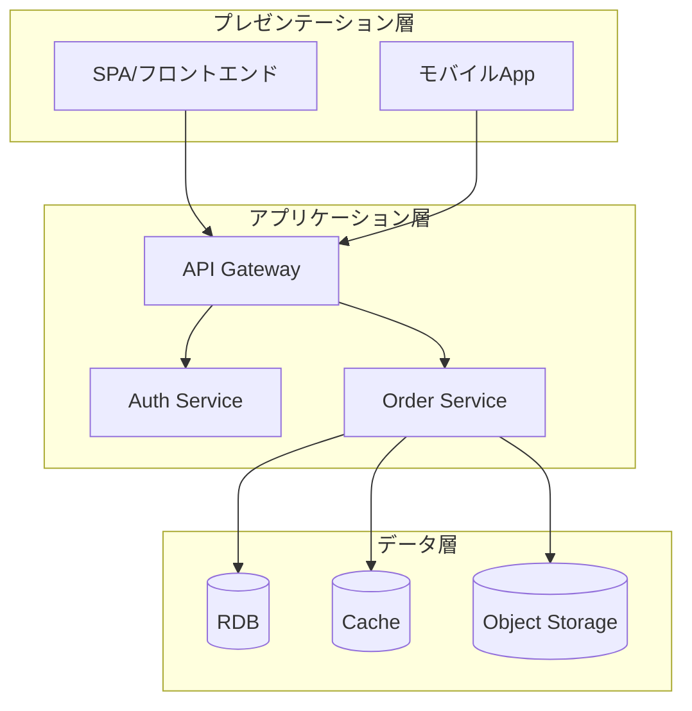

---

# 10) 業務⇄機能マッピング（バイパートイト）

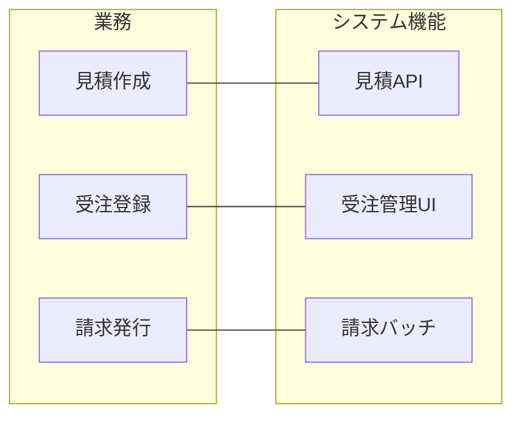

---

# 11) タイムライン（時系列イベント）

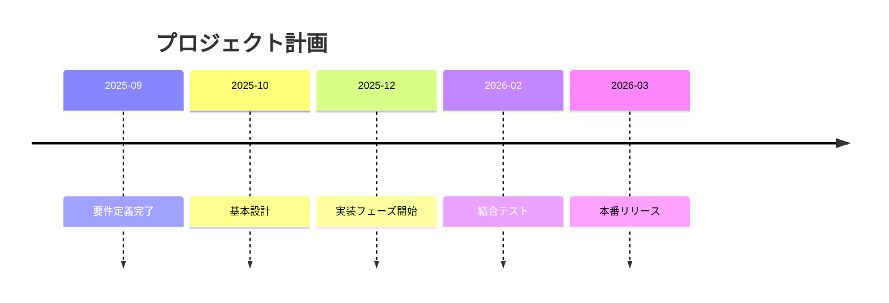

---

# 12) カスタマージャーニー（Journey）

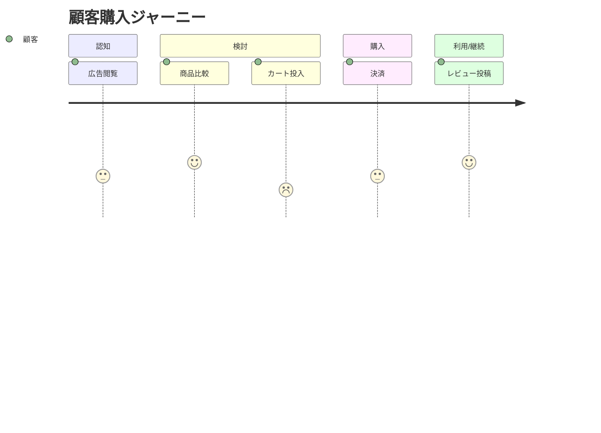

---

# 使い方のコツ（超要約）

* 図の**向き**は `flowchart TD/LR` を切り替え。
* **レーン**は `subgraph` で代用。
* **DB/外部**は `[(DB)]` / `((外部))` など形状記法で視認性UP。
* コードを**部品化**したいなら、ひな形をスニペット管理（VS Codeなど）に登録。

---

# 特殊文字のエスケープ（重要）

Mermaid では一部の文字が構文として解釈されるため、ノードテキスト内で使用する場合は対処が必要です。

## 対応が必要な文字

| 文字 | 問題 | 推奨対処 |
|------|------|---------|
| `(` `)` | ノード形状記法と競合 | 全角 `（）` に置き換え、またはダブルクォートで囲む |
| `&` | HTMLエンティティの開始と解釈 | 全角 `＆` に置き換え |
| `\|` | リンクラベル記法と競合 | `&#124;` または全角 `｜` |
| `<` `>` | HTMLタグと解釈 | `&lt;` / `&gt;` |
| `"` | 文字列の区切りと競合 | 外側を `[]` に変更 |

## 安全なノードテキストの書き方

### 悪い例（エラーになる）
```mermaid
flowchart LR
    A{OR演算<br/>||} --> B[結果]
    C{AND演算<br/>&&} --> D[結果]
    E[概要（現在）] --> F[次へ]
```

### 良い例
```mermaid
flowchart LR
    A{"OR演算 &#124;&#124;"} --> B[結果]
    C{"AND演算 ＆＆"} --> D[結果]
    E["概要（現在）"] --> F[次へ]
```

## ベストプラクティス

1. **特殊文字を含むテキストは `""` で囲む**: `A{"テキスト"}`
2. **括弧は全角に統一**: `（）` を使うと最もシンプル
3. **アンパサンドは全角に統一**: `＆` を使うと最もシンプル
4. **改行は控えめに**: `<br/>` よりスペース区切りを推奨
5. **生成後は必ずブラウザで表示確認**: Syntax error が出ていないかチェック
